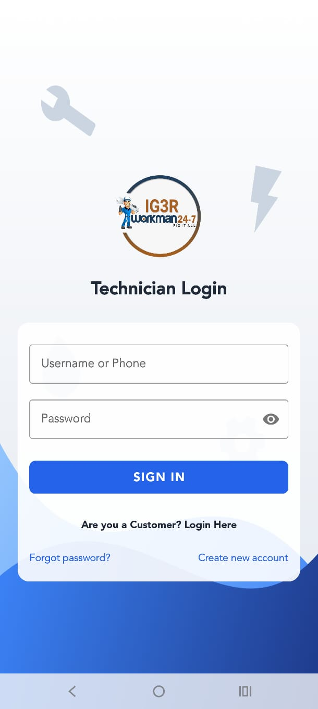

# WorkMan - On-Demand Professional Services Platform

**WorkMan** is a complete, end-to-end on-demand service marketplace platform connecting customers with professional service technicians (such as plumbers, electricians, appliance repairers, and mechanics) for home repairs, maintenance, and utility services.

The project features a **native Android Application** for both customers and technicians, backed by a robust **PHP Web Admin Dashboard** for management, and REST APIs for backend integration.

---

## 🚀 Key Features

### 👨‍💼 Customer Features
- **Account Management**: Signup/login with validation, profile editing, and password recovery.
- **Service Browsing**: View diverse service categories, search, and filter options.
- **Enquiry & Booking**: Post detailed requests with descriptions, upload photos of the issues, and select specialized categories/vendors.
- **Interactive Tracking**: Monitor the status of job requests (Pending ➔ Accepted ➔ Completed).
- **Payment Integration**: Pay for services securely via Paystack or direct Bank Transfer upload forms.
- **QR Code Verification**: In-app QR code verification system to secure the start/end of services with the assigned technician.
- **Feedback & Reviews**: Rate and review technicians upon successful completion of jobs.

### 🛠️ Technician Features
- **Registration & Profile Setup**: Create profiles indicating specialization areas, businesses, and profile image uploads.
- **Job Pipeline**: View and manage real-time pending jobs, accept incoming service requests, and track active bookings.
- **Real-time Location Updates**: Update current coordinates for navigation and customer tracking.
- **Job Status Management**: Change status, log issues/fault items, and verify services via customer QR codes.

### 💻 Web Admin Panel
- **Comprehensive Dashboard**: View platform metrics, pending approvals, and charts showing active transactions.
- **Content Management**: Add, update, and activate/deactivate service categories, subcategories, and plans.
- **User Management**: Manage customers, vendors, and technician verification statuses.
- **Job & Financial Auditing**: View service requests, approve payments, and generate invoices.

---

## 📸 Screenshots

| Customer Dashboard | Technician Login |
| --- | --- |
|  |  |

---

## 🛠️ Tech Stack

- **Mobile Client**: Native Android App (Java), Retrofit 2 (for REST API consumption), RxJava 2, OkHttp, Gson, Camera/Image Pickers, QR Scanner SDK.
- **Backend API**: PHP (REST APIs handling JSON responses).
- **Admin Dashboard**: PHP with `ElaAdmin` (Bootstrap 4, ChartJS, jQuery) dashboard template.
- **Database**: MySQL.

---

## 📦 Getting Started & Configuration

For security and deployment flexibility, the API base URLs have been removed from the repository version of the code. Follow these steps to configure and run the project:

### 1. Backend Server Setup
1. Move the `servercode/serviceadmin` folder to your PHP-capable web server directory (e.g., `htdocs` in XAMPP/WAMP, or a live hosting directory).
2. Create a MySQL database (e.g., named `workman`).
3. Import the database schema and sample data using the SQL dump file located at:
   - `servercode/workifdo_workman.sql`
4. Configure your database connection details (host, username, password, database name) in:
   - `servercode/serviceadmin/dbconfig.php`
   - `servercode/serviceadmin/apis/dbcon.php`

### 2. Android App Configuration
Before compiling the Android application, you must link it to your backend API server:
1. Open the project in Android Studio.
2. Navigate to `app/src/main/java/com/np/onei/utils/Const.java`.
3. Set your server's host URL and image resource base directory:
   ```java
   public class Const {
       // Point to your hosted backend (e.g. "http://192.168.1.100/serviceadmin/apis/")
       public static final String BASE_URL = "YOUR_API_BASE_URL";
       
       // Point to your hosted assets/uploads directory (e.g. "http://192.168.1.100/serviceadmin/")
       public static final String BASE_URL_IMG = "YOUR_RESOURCES_BASE_URL";
   }
   ```
4. Build and deploy the APK to your testing devices.
